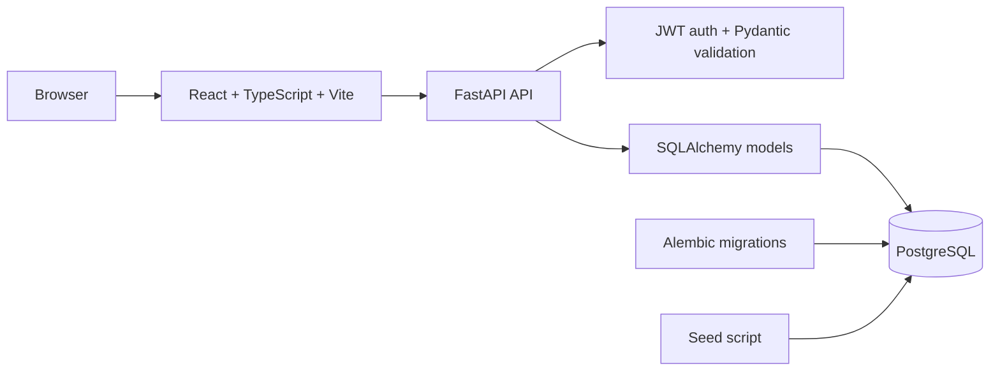

# Fitness Tracker

A Dockerized portfolio MVP for tracking a home or gym strength program, daily body metrics, nutrition targets, and simple training analytics. The app is built around a realistic weekly home-training workflow while keeping the architecture clean enough to extend into a larger product.

## Features

- JWT authentication with register, login, and protected routes
- User onboarding and profile targets for training mode, protein, and calories
- Seeded exercise library with equipment, instructions, alternatives, and easier variations
- Weekly plan view with recovery/strength day treatment and user-specific exercise swaps
- Active workout logger for sets, reps, weight, and RPE
- Body metric and quick nutrition logging
- Dashboard analytics for weight, waist, workout count, protein, steps, and training volume
- Recharts trend charts for bodyweight, waist, and weekly volume
- PostgreSQL persistence with SQLAlchemy 2.x and Alembic migrations
- Fully Dockerized frontend, backend, and database services

## Architecture



Runtime services:

- `frontend`: React/Vite app served on `http://localhost:5173`
- `backend`: FastAPI app served on `http://localhost:8000`
- `db`: PostgreSQL 16 on the internal Docker network with a named data volume

## Screenshots

Place screenshots in `docs/screenshots/` when capturing the portfolio:

- `docs/screenshots/dashboard.png`
- `docs/screenshots/weekly-plan.png`
- `docs/screenshots/active-workout.png`
- `docs/screenshots/progress.png`
- `docs/screenshots/exercise-library.png`

Suggested capture flow: seed the database, log in as the demo user, then capture the dashboard, weekly plan, progress table, and workout logger.

## Local Docker Setup

Prerequisites:

- Docker Desktop or Docker Engine with Docker Compose
- `make` is optional; direct Docker Compose commands are listed below

From a clean clone:

```bash
cp .env.example .env
docker compose up --build
```

The backend waits for PostgreSQL, runs `alembic upgrade head`, then starts FastAPI. This means `docker compose up --build` works against a fresh named Postgres volume.

Open:

- Frontend: http://localhost:5173
- Backend health: http://localhost:8000/health
- API docs: http://localhost:8000/docs

## Demo Data

Seed the default home workout plan and demo account:

```bash
docker compose run --rm backend sh -c "python -m app.wait_for_db && python -m app.seed"
```

Or with Make:

```bash
make seed
```

Demo login for local portfolio review:

- Email: `demo@example.com`
- Password: `demo-password`

The seed script is idempotent. It creates the exercise library, default weekly program, a demo profile, two weeks of progress entries, and recent workout logs.

## Common Commands

```bash
docker compose up --build
docker compose down
docker compose logs -f
docker compose build
```

Make equivalents:

```bash
make up
make down
make logs
make build
make lint
make format-check
make test
make migrate
make seed
```

## Migrations

Run migrations inside Docker:

```bash
docker compose run --rm backend sh -c "python -m app.wait_for_db && alembic upgrade head"
```

Create a new migration after changing SQLAlchemy models:

```bash
docker compose run --rm backend alembic revision --autogenerate -m "describe change"
```

Check migration drift:

```bash
docker compose run --rm backend alembic check
```

## Tests And Checks

Backend tests:

```bash
docker compose run --rm --no-deps backend pytest
```

Frontend tests:

```bash
docker compose run --rm --no-deps frontend npm test
```

Frontend build/type check:

```bash
docker compose run --rm --no-deps frontend npm run build
```

Lint/format checks:

```bash
docker compose run --rm --no-deps backend sh -c "python scripts/check_format.py --check && python -m compileall -q app tests"
docker compose run --rm --no-deps frontend npm run lint
docker compose run --rm --no-deps frontend npm run format:check
```

## Environment

Frontend environment variables:

- `VITE_API_BASE_URL`: browser-facing backend URL, default `http://127.0.0.1:8000`
- `VITE_AUTH_TOKEN_STORAGE_KEY`: localStorage key for the JWT access token

Backend/database environment variables:

- `DATABASE_URL`: SQLAlchemy/Postgres connection URL used by FastAPI and Alembic
- `SECRET_KEY`: JWT signing secret; change this outside local development
- `ALGORITHM`: JWT algorithm, default `HS256`
- `ACCESS_TOKEN_EXPIRE_MINUTES`: JWT lifetime in minutes
- `BACKEND_CORS_ORIGINS`: comma-separated frontend origins
- `POSTGRES_DB`, `POSTGRES_USER`, `POSTGRES_PASSWORD`: Postgres container credentials

`.env` is gitignored. `.env.example` is the committed reference.

## Security Notes

- Passwords are hashed with Passlib/bcrypt; plain-text passwords are not stored.
- JWT secrets and token settings come from environment variables.
- Protected API routes require a bearer token.
- Pydantic and Zod validate request bodies on backend and frontend.
- CORS is scoped to local frontend origins by default.
- PostgreSQL is internal-only in Docker Compose and is not published to the host.
- The demo account is for local development and portfolio review only. Do not reuse the demo password or development `SECRET_KEY` in deployed environments.

## Troubleshooting

If the frontend cannot reach the backend:

- Confirm the backend is healthy with `curl http://127.0.0.1:8000/health`.
- Confirm `VITE_API_BASE_URL` points to a browser-accessible backend URL.
- Confirm `BACKEND_CORS_ORIGINS` includes the frontend origin you are using.

If migrations fail:

- Run `docker compose logs backend db`.
- Run the migration command again after the database is healthy.
- For a disposable local database, reset with `docker compose down -v`.

If seed data is missing:

- Run `make seed` or the Docker seed command above.
- Log in with the demo account after seeding.

If one-off commands use stale code:

- Run `docker compose build`.
- The Makefile test and lint commands build relevant images first.

## Roadmap

- CSV export for workout logs and body metrics
- More analytics: PR tracking, adherence trends, and volume by muscle group
- Exercise creation and program editing flows
- Equipment-aware alternative suggestions beyond seeded alternatives
- Optional gym/home program templates
- Frontend component tests for critical workflows
- Production deployment profile with stricter secrets and CORS settings
